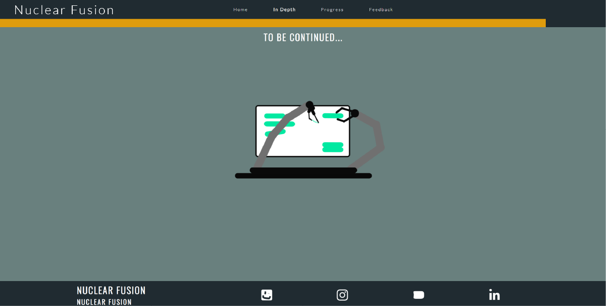

# Nuclear Fusion

## This is a project that provides it's users with knowledge about Nuclear Fusion  

[link to the live deployed version website](https://bogdan-branzaniuc.github.io/Project-1-HTML-CSS/index.html)

## Display
  
* Web-large
* web-small
* tablet-portrait
* tablet-landscape
* phone-portrait
* phone-landscape

## Features

* ## Main Navigation Bar

- the nav-bar has a Logo-title and 4 buttons to the rest of the pages.
- the buttons scale 1.3 times when hovered. 
- the current-page has it's button's text in the nav-bar bold

- bellow 1200px width of the window, the nav-bar-menu displays a bar-icon. 
- it is scaled 1.3 times when hovered or touched and a menu with the other page's titles appears and it will stay visible untill pressed again. 
  
**** I used JS code to make the bars-icon and menu possible, when I tried using bootstrap, it was already breaking other parts of the css code because of naming conflicts. ****

* ## Side-scrolling Navigation Bar

- The scrolling menu is using JavaScript code to move the yellow slider acros the menu.
- It has icons acting as links to various sections of the page
- It is also using JS code to find the right distance between the icons, as the sections have different sizes, that gives the user a better idea of how the content ahead is structured  
- By hovering or tocuhing the icons , a short title of the anchored section appears.  
 
 
 

################################################################################################ 
################################################################################################ 
################################################################################################ 
  # Unsolved Bug
 ####  **when changing the screen orientation, the JS code is listening for the screen.orientation.onchange event to locally refresh the page, in order to deal with increasing height or width of the slider. This means the program wil only know the orientation is changed when the user is actioning the accelerometer of the phone or tablet by turning it.**  ####
  #### When manually resizing the browser, it currently requires a refresh of the page. This is a big minus in case somebody wants to resize the browser to fit on half ov their screen while doing something else on the computer.** 
 
 this is the way it behaves without the manual refresh when manually resizing the browser window:  

 Once a refresh is made the JS is managing to read the screen orientation properly. 
 

 ### I made a choice of focusing more on the required functions of the project, and I also made a clone of this repository so I'll be solving it in the future without interfering with the submittet project.
################################################################################################ 
################################################################################################ 
################################################################################################ 
 
 
 
# Throughout my project i used Lottie Animations. 
## theese are vector-shaped animations converted into JSON files which then can get interpreted by the Lottie Files JS functions to make the animations in the browser smooth and light-weight.

for more documentation here are two essential links :  
[Lottie Docs](https://airbnb.io/lottie/#/)  
[Lottie Interractivity](https://lottiefiles.com/interactivity)

    
* # Home page
## Sections:
  - ## introductory-section
    - the introductory section has 3 headings with 3 paragraphs explaining 
        * why nuclear fusion, 
        * what problems would it solve
        * what do we have to do to achieve it.
     - next noticeable element of this section is a tokamak reactor in the background with an animated plasma
       * this animation was achieved by using a total of 4 json-files + a css gradient for the light inside:
       * 1st json-file was the 2 magnets in the background + the 2 horizontal coils meeting at the back  
       the vector reactor was made entirely by me using Adobe Illustrator, and then converted into a JSON file, even if static, for responsive reasons in relation with the rest of the moving and static layers 
        * 2nd json-file constitutes the animated white circular lines, as it is overlaping the most with the other moving parts, it's better to have it's own "moving logic".
        * 3rd json-file represents all the other animated shapes and lines with less overlaping involved  
         this json file is a collection of other 4 free animations from [lottie-files.com](https://lottiefiles.com/), which I nested in 1 single file using Adobe After Effects + bodymovin extension.
        * The CSS gradient comes in right here (it was achieved through [cssgradient.io](https://cssgradient.io/))
        * 4th json file represents the central mast with the other two magnets and the ends of the horizontal coils.
      *it shares the same logic as the 1st json file*
    
   

- ## Fusion -concept-explained-section
    - elements:
      - Heading
      - 3 paragraphs shortly explaining what a Fusion Reaction is
      - A Lottie Animation (JSON file) refering to the high density plasma mentiond in the paragraphs
       this is a free animation downloaded from  [lottie-files.com](https://lottiefiles.com/)
   
- ## Fission -concept-explained-section
    - elements:
       - Heading
       - 4 paragraphs explaining what a Fission Chain reaction is, and why Fusion will be much cleaner
       - A Lottie Animation (JSON file) of an atom circled by high-velocity protons iluustrated as elipses. 
      Unlike the other animations above, this one is scroll-responsive.  
      this is a free animation downloaded from [lottie-files.com](https://lottiefiles.com/)
      
- ## Fusion Efficency 
    - elements:
      - Heading
      - 4 paragraphs explaining the current level of fusion efficency the science has achieved by the ned of 2021
      - A Lottie Animation (JSON file) illustrating charts and an animated mini-wire-frame 
      this is a free animation downloaded from [lottie-files.com](https://lottiefiles.com/)  
     
- ## Energy storage systems 
    - elements:
      - Heading
      - 3 paragraphs explaining what a storage-systep-is, (battery)
      - A Lottie Animation (JSON file) of a power grid feed by dots refering to energy input (scroll responsive )  
      this is a free animation downloaded from [lottie-files.com](https://lottiefiles.com/)
      - An iframe of [a great youtube video made by TedEd channel about batteryes.](https://www.youtube.com/watch?v=r4OWMSG4Agg&ab_channel=TED-Ed) 
    
- ## Footer
    - elements:
      - Heading
      - 4 mooving icons(Lottie Animations) illustrating the social media links to Facebook, Instagram, youtube, liked-in.  
      these are free animations downloaded from [lottie-files.com](https://lottiefiles.com/) 
  
        
* # In Depth, Progress and Feedback pages
 From reasons of time and quality over quantity I choose to focus only on the home page first. 
 every page of these three currently displays a lottie animation with 2 robotic arms building a layout on a white display
  
       
*  # Responsiveness
   ## Homepage uses 4 css documents : 
        - style.css, 
        - main-nav.css, 
        - scrollbar-and-nav.css, 
        - footer.css
    - the main navigation bar has it's own css file
    - the scroll in-page-navigation bar has it's own css file as well. 
    - the introductory section is using 2 classes to display the headings and paragraphs and 1 class to display the animation files **absolute**, in the same way, so they create a compact animation at all times.
    - the next 4 sections are using 1 class with "display: flex;" property.
    - the Iframe is resting in the last section, in it's own flex-container, being at the center of the page at all times. 
    - the footer has it's own css file.
    ## the To Be Continued Page uses 1 css document : 
        - maintenance.css

  # media queryes used throughout the project: 
  <table>
  <tr>
   <td>@media screen and (max-width:1600px) </td>
   <td>style.css</td>
   <td>main-nav.css </td>
   <td>footer</td>
  </tr>
   <td>@media screen and (max-width:1200px) </td>
   <td>style.css</td>
   <td>main-nav.css </td>
   <td>footer</td>
   <td></td>
   <td>maintenance.css</td>
  </tr>
  <tr>
   <td>@media screen and (max-width:1000px) </td>
   <td></td>
   <td></td>
   <td></td>
   <td>scroll-nav</td>
  </tr>
  <tr>
   <td>@media screen and (max-width:800px) </td>
   <td>style.css</td>
   <td>main-nav.css </td>
   <td>footer</td>
   <td></td>
   <td>maintenance.css</td>
  </tr>
  <tr>
   <td>@media screen and (max-width:600px) </td>
   <td>style.css</td>
   <td>main-nav.css </td>
   <td></td>
   <td>scroll-nav</td>
  </tr>
  <tr>
   <td>@media (orientation: landscape) </td>
   <td>style.css</td>
   <td>main-nav.css </td>
   <td>footer</td>
  </tr>
  <tr>
   <td>@media screen and (max-width:1200px) and (orientation:landscape) </td>
   <td></td>
   <td>main-nav.css </td>
  </tr> 
  <tr>
   <td>@media screen and (max-height: 900px) and (orientation:landscape) </td>
   <td></td>
   <td>main-nav.css </td>
   <td></td>
   <td>scroll-nav</td>
  </tr> 
  <tr>
   <td>@media screen and (max-height: 600px) and (orientation: landscape) </td>
   <td></td>
   <td>main-nav.css</td>
  </tr> 
  <tr>
   <td>@media screen and (max-height:500px) and (orientation: landscape) </td>
   <td>style.css</td>
  </tr> 
  </table>

 
 

 # Whire Frame
  Figma was used as a whire-frame
  

# Technoligies used
- HTML
- CSS
- JavaScript
- [LottieFiles - animations based on JSON files.](https://lottiefiles.com/)
- [Figma-design](https://www.figma.com/files/recent?fuid=722165586962807899)
- Adobe illustrator
- Adobe After Effects

## Testing
- light-house (i made sure to test the github hosted version, as it enables files-compression)
  - desktop 
  - mobile 
-html validator
-css-validator
-js-validator
-clicks
-whatIsMyScreenResolution.net
## Illustrations and animations 

## Credits
- ### Youtube Iframe                                             
 - TED_Ed : https://www.youtube.com/watch?v=r4OWMSG4Agg&ab_channel=TED-Ed  The world's biggest battery looks nothing like a battery                                     
- ### Lottie-files(animations)  
